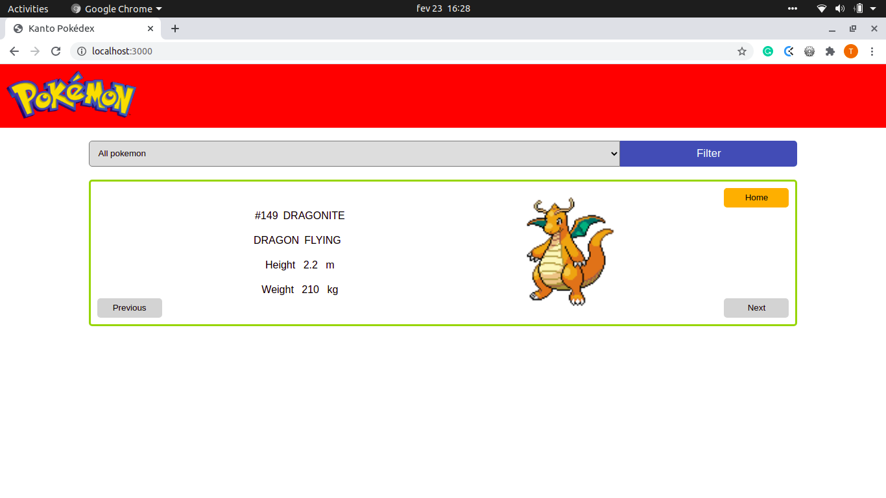

# React & Redux Capstone

#### Hello there! Welcome to my Kanto National Pokédex. For this project, I have created a React & Redux app that consumes data from [this awesome API](https://pokeapi.co/), in order to recreate the Kanto region Pokédex from the Pokémon series. The user can check information about all 151 Pokémon from the first season of the anime!

#### Features
- Index the original 151 Pokémon
- Filter the Pokémon by their types
- Check detailed information about each Pokémon

#### Screenshot



#### Livedemo

- [Github](https://relaxed-leakey-500f5c.netlify.app/)

## Built With

- [React](https://reactjs.org/)
- [Redux](https://redux.js.org/)

## Packages
- [Babel](https://babeljs.io/)
- [Core JS](https://www.npmjs.com/package/core-js)
- [CSS Loader](https://webpack.js.org/loaders/css-loader/)
- [Eslint](https://eslint.org/)
- [File Loader](https://webpack.js.org/loaders/file-loader/)
- [Phaser](https://phaser.io/)
- [Style Loader](https://webpack.js.org/loaders/style-loader/)
- [Stylelint](https://stylelint.io/)
- [Webpack](https://webpack.js.org/)

## Getting started

### Setup

Clone the repo with

```
  https://github.com/tadeuasarro/pokedex.git
```

Install packages with

```
  npm install
```

Start server with:

```
    npm start
```

Open `http://localhost:9000/` in your favorite browser.

### Run tests

```
    npm test
```

### Authors

👤 This is me:

- [Tadeu A Sarro](https://tadeuasarro.me)


### Contributing

Contributions, issues and feature requests are welcome!

Feel free to check the [issues page](https://github.com/tadeuasarro/pokedex/issues)


### Show your support

Give a star if you like this project!

### Acknowledgments

- [Game Dev Academy](https://gamedevacademy.org/)
- [Microverse](https://www.microverse.org/)

### 📝 License

This project is MIT licensed.